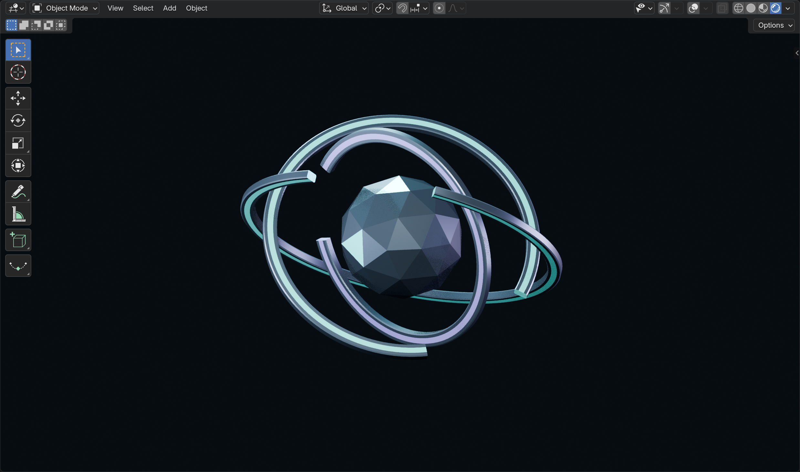

# ORBIT

A presentation-only 3D landing project for a fictional workspace where small teams organize, run, and review AI workflows.

## Current state

The product brief, Blender MCP configuration, and AI Core model are ready. The Next.js application and web integration have not been implemented yet. There is no working AI backend or account system.

## Inspiration and customizations

The project is inspired by a course workflow for building a 3D landing with AI-assisted development and Blender MCP. It follows an incremental process rather than copying the course's final implementation.

ORBIT's customizations include:

- An original fictional product concept centered on shared context, connected tools, and review checkpoints.
- English product copy and a dark graphite palette with cold teal and restrained violet accents.
- A custom AI Core built from a low-poly icosphere and three open orbital bands with different inclinations and gap positions.
- A compact, texture-free GLB export with applied transforms and a centered origin.

## Model assets

| File | Purpose |
| --- | --- |
| `assets/ai-core.blend` | Editable source with Blender-only preview lights, camera, and world |
| `assets/ai-core.glb` | One exportable mesh, four materials, and 8,204 triangles; 255,832 bytes |
| `assets/ai-core-viewport.png` | Rendered Blender viewport screenshot |

The GLB passed Khronos glTF Validator with zero errors and warnings, as well as a Blender import round-trip. See [model notes](docs/ai-core.md) for checks and limitations.

## Blender MCP

The project-level Pi configuration is in `.pi/mcp.json`. It launches the official [Blender MCP](https://projects.blender.org/lab/blender_mcp) through `uvx`.

Install `uv` and Pi, then install and enable the Blender MCP add-on in Blender through the Blender Lab extensions repository at `https://lab.blender.org/`. Start the add-on's local bridge and run `pi mcp list` from the project root to check the MCP server. A successful scene query confirms the Blender bridge connection.

## Planned web stack

TypeScript, Next.js 16 App Router, React 19, Tailwind CSS, Three.js, React Three Fiber, and Drei. Web integration, mobile composition, accessible interaction, reduced motion, and a static fallback remain to be implemented.

The [product brief](docs/brief.md) defines the landing's scope and copy. Application lint and build commands are not available until the application is created.
